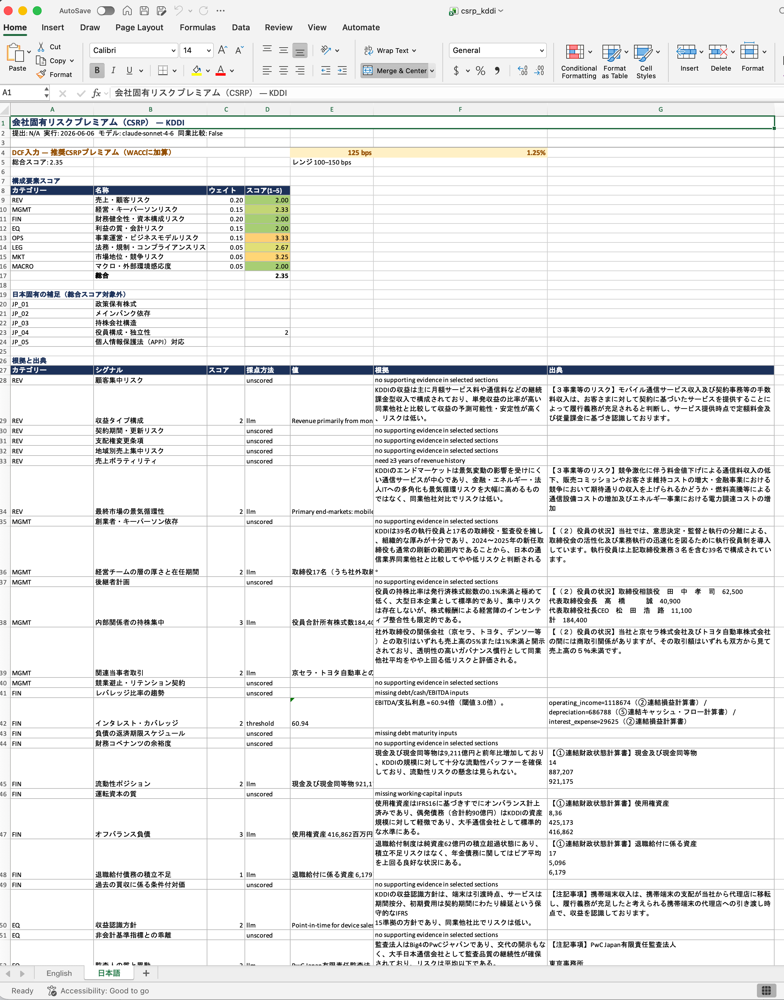
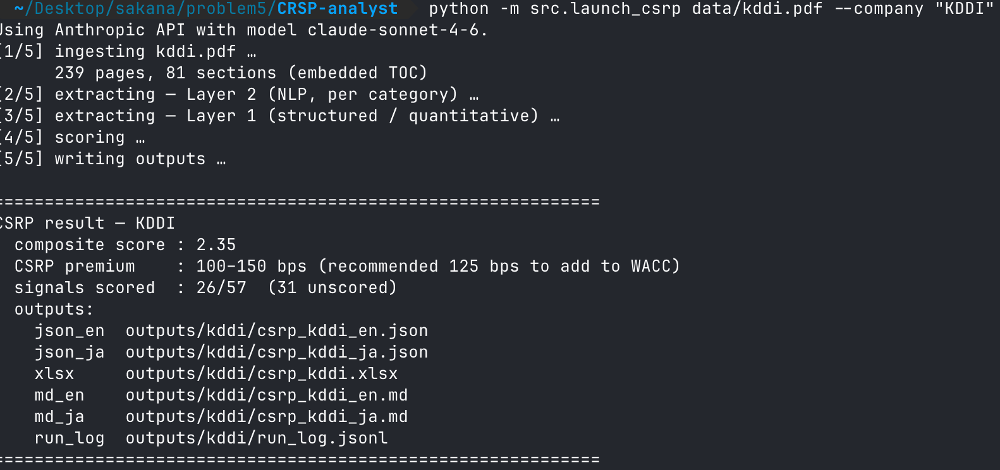

# Company Specific Risk Premium (CSRP) Analyst

An **LLM-as-judge** agentic pipeline that automatically extracts relevant risk 
signals from Japanese corporate financial statements (有価証券報告書) to determine 
the Company-Specific Risk Premium (CSRP) for a target company. The CSRP value 
is intended to be used by an M&A valuation analyst as an input into a Discounted 
Cash Flow (DCF) model. This is a proof-of-concept: it illustrates how such a 
pipeline could work, but does not yet use the data sources that would be available 
in a realistic private company valuation scenario, where inputs are expected to be 
far more varied and less structured than a statutory financial filing.

There is an art to DCF valuation, particularly for privately owned businesses. 
For publicly traded companies, cost of capital inputs — equity beta, market-implied 
cost of debt, observable capital structure weights — can be read directly from 
market data. For private companies, none of these are available, and the discount 
rate must be built up from first principles. CSRP is the component of this build-up 
that captures idiosyncratic risks specific to the target — operational, financial, 
legal, and competitive — that neither market exposure nor firm size explain. 
Estimating it requires an analyst to synthesize evidence across a large, 
heterogeneous set of documents, apply a consistent scoring framework, and 
exercise judgment on factors that are rarely disclosed explicitly. This process 
is time-consuming, difficult to standardize across analysts, and prone to 
inconsistency — all of which make it a strong candidate for AI-assisted automation.

## 📊 Result
The final output from the AI agent pipeline is an Excel spreadsheet (see screenshot below). The spreadsheet contains:

1. The final CSRP value proposed by the AI agent
2. Scores for each of the components, and corresponding weights selected by the user
3. A detailed section for how each of the component scores were determined, along with rationale and citations pulled from the source material

## 🎬 Operation
In order to operate the pipeline, run the python script **launch_csrp.py** as shown below:

## 🌊 Methodology 

The LLM assesses CSRP against a rubric-style risk taxonomy, scoring each signal 
on a 1–5 scale relative to industry peers and aggregating scores into a final 
basis-point premium. At a high level, the agentic pipeline:

1. **Ingests** the financial statement PDF, decoding Japanese CID fonts to extract 
   clean text
2. **Selects** relevant sections autonomously by reading the table of contents 
   first, then fetching only the pages pertinent to each risk category — avoiding 
   full-document ingestion to manage token costs
3. **Extracts** risk signals via two parallel paths: a structured layer that 
   computes quantitative ratios directly from financial tables (leverage, coverage, 
   working capital trends), and an unstructured NLP layer where the LLM reads 
   free-text sections including risk disclosures, MD&A, footnotes, and the auditor 
   report
4. **Scores** each signal using an LLM-as-judge, producing a chain-of-thought 
   rationale and a 1–5 score across eight weighted risk categories, plus five 
   Japan-specific supplemental signals covering cross-shareholdings, main bank 
   relationships, holding company structure, board composition, and data privacy 
   compliance
5. **Grounds** every score in a cited passage from the source document — signals 
   that cannot be cited are marked unscored rather than estimated
6. **Outputs** a structured Excel workbook in both English and Japanese, containing 
   all signal scores, citations, category weights, and the final CSRP basis-point 
   range, ready for direct ingestion into a DCF model

This project is an adaptation of the 
[AI Scientist Automated Reviewer](https://github.com/SakanaAI/AI-Scientist), 
repurposing its LLM-as-judge architecture, citation enforcement pipeline, and 
PDF parsing utilities for a financial due diligence context. The core insight 
is that rubric-based document assessment — whether evaluating a NeurIPS submission 
or a corporate filing — shares the same fundamental structure: a document corpus, 
a defined evaluation rubric, and a requirement that every scored judgment be 
traceable to specific evidence in the source material.